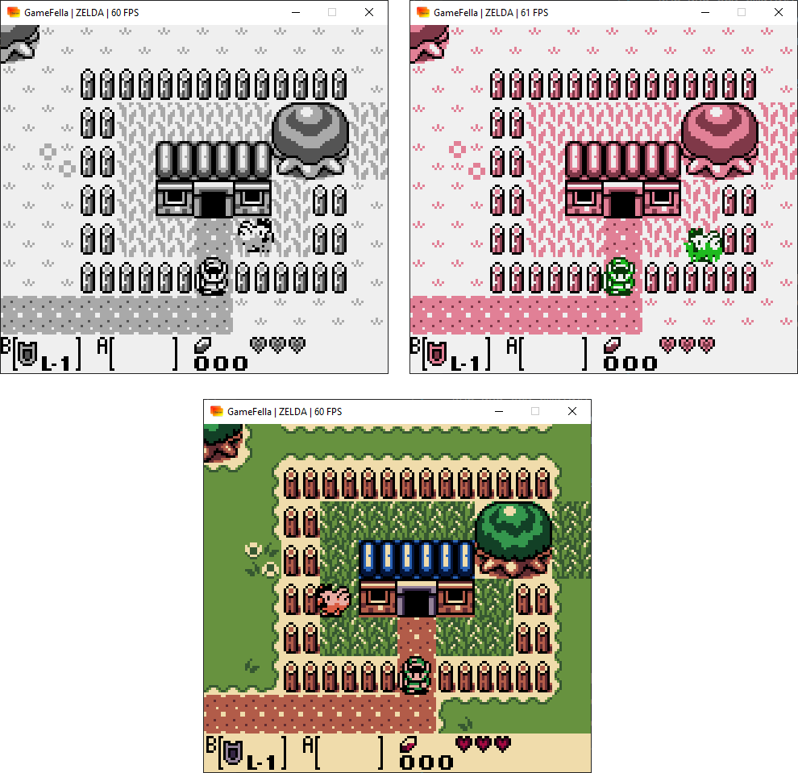

# GameFella

GameFella is a Nintendo GameBoy and GameBoy color emulator written in Go. Developed for fun, and likely has numerous bugs.

## Features

- DMG and CGB emulation
- DMG games with CGB color palettes (with CGB boot-rom only)
- CGB Color Correction
- Sound
- MBC1, MBC3, and MBC5 Memory Bank Controllers
- Battery Saves
- DMG and CGB Boot ROM Support

## Screenshots




## Dependencies

- `go 1.17`
- `github.com/akamensky/argparse`
- `github.com/hajimehoshi/oto`
- `github.com/sqweek/dialog`
- `github.com/veandco/go-sdl2`

## Usage

```
usage: GameFella [-h|--help] [-b|--boot "<path_to_boot_rom>"] [-s|--scale <integer>]
                 [-d|--debug]

                 A simple GameBoy emulator written in Go.

Arguments:

  -h  --help   Print help information
  -b  --boot   Path to boot ROM. Default: None
  -s  --scale  Scale of the screen. Default: 3
  -d  --debug  Turns on debugging mode. Default: false
```

## Controls

|   Button  |       Key        |
| :-----: | :-----------------: |
| `Up`    |     `W`     |
|   `Down`   | `S` |
|   `Left`   | `A` |
|   `Right`   |     `D`      |
|   `A`   |     `J`     |
|   `B`   |        `K`        |
|`Start`    |`Enter`|
|`Select`   |`Right Shift`|
